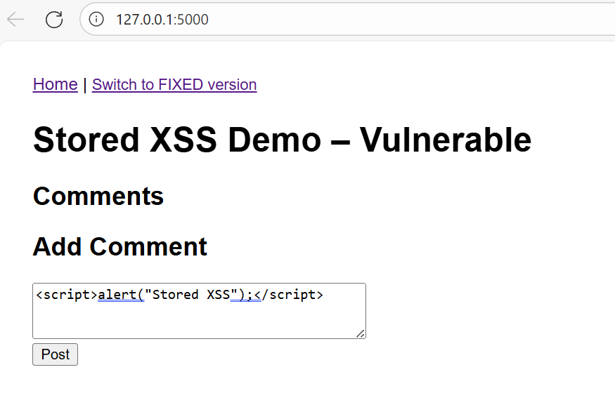

# Flask Stored XSS Demo

This demo shows one example of how **Stored (Persistent) Cross-Site Scripting (XSS)** works and how to fix it.

It focuses on a common Stored XSS pattern in Flask/Jinja applications: rendering untrusted user input with the `safe` filter. Real-world Stored XSS vulnerabilities can arise through many other unsafe rendering paths, contexts, and framework-specific escape hatches.

## OWASP Guidance and Scope

This demo follows the guidance from the OWASP Cross Site Scripting Prevention Cheat Sheet.

Key takeaways:

- Use your framework's built-in output encoding whenever possible.
- Avoid bypassing framework protections with unsafe rendering features such as Jinja's `safe` filter.
- Validate input for business requirements, but do not rely on input sanitization alone to prevent XSS.
- Use HTML sanitization only when users must be allowed to submit limited HTML content.
- Consider Content Security Policy (CSP) as a defense-in-depth control.

Reference:
https://cheatsheetseries.owasp.org/cheatsheets/Cross_Site_Scripting_Prevention_Cheat_Sheet.html

## Vulnerable Version

* User comments are stored unchanged.
* The template renders comments using Jinja's `safe` filter:

```html
<li>{{ c|safe }}</li>
```

* Any script injected by one user executes for all future visitors.
* Example impact: session theft, account takeover, page defacement, or malicious actions performed in the victim's browser.

## Fixed Version

* User input is rendered using Jinja2's default autoescaping.
* The dangerous `safe` filter is removed:

```html
<li>{{ c }}</li>
```

* No dangerous HTML or JavaScript executes.

## Security Detection

This repository includes a Semgrep rule that detects unsafe usage of Jinja's `safe` filter.

Example finding:

```html
<li>{{ c|safe }}</li>
```

Semgrep flags this pattern because `safe` disables Jinja's automatic HTML escaping. If untrusted user input reaches this sink, a Cross-Site Scripting (XSS) vulnerability can occur.

Example CI output:

```text
Detected a segment of a Flask template where autoescaping is explicitly disabled with '| safe' filter.
This allows rendering of raw HTML in this segment.
Ensure no user data is rendered here, otherwise this is a cross-site scripting (XSS) vulnerability.
```

This demonstrates a common AppSec workflow:

1. Vulnerable code is introduced.
2. Static analysis (Semgrep) detects the risky pattern.
3. The finding is reviewed and validated.
4. The vulnerable code is fixed.
5. CI passes with the corrected implementation.

## Running

```bash
python3 -m venv .venv
source .venv/bin/activate
pip install -r requirements.txt
python app.py
```

Visit:

* http://localhost:5000/?mode=vuln
* http://localhost:5000/?mode=fixed

## Example Payload

```html
<script>alert("Stored XSS");</script>
```

Paste the payload into the vulnerable version and submit the comment. The script will be stored and execute whenever the page is viewed.

The same payload rendered in the fixed version is displayed as text and does not execute.


## UI Preview

<details>
  <summary>Click to expand screenshot</summary>

  

</details>
